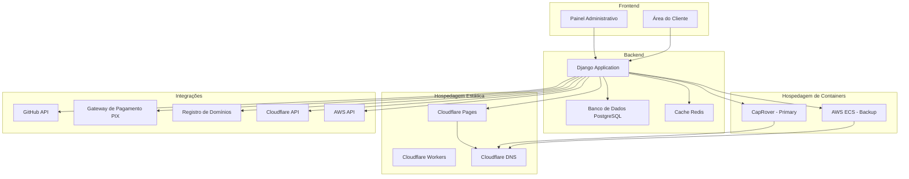

# LindaHost - Plataforma de Hospedagem Inteligente

Uma plataforma completa de hospedagem que integra Cloudflare Pages para sites estáticos, CapRover para containers e AWS ECS como backup, com sistema de pagamento PIX para registro de domínios.

## 📊 Status do Projeto

- ✅ **Backend Django**: Implementado com modelos completos
- ✅ **Integração Cloudflare**: API para Pages e DNS
- ✅ **Integração AWS**: ECS como backup
- ✅ **Sistema de Usuários**: Roles e créditos
- ✅ **Deployments**: Suporte a sites estáticos e containers
- ✅ **Domínios**: Registro e configuração automática
- ✅ **Pagamentos**: Sistema PIX integrado
- 🔄 **Frontend**: Templates básicos implementados
- 🔄 **Testes**: Em desenvolvimento
- 🔄 **Documentação**: Em constante atualização

## 🚀 Recursos Principais

- **Sites Estáticos**: Deploy automático no Cloudflare Pages com CDN global
- **Containers**: Hospedagem em CapRover com backup automático na AWS ECS
- **Domínios**: Registro e configuração automática com pagamento PIX
- **GitHub Integration**: Deploy automático a partir de repositórios GitHub
- **Dashboard Administrativo**: Painel completo de controle e monitoramento

## 🏗️ Arquitetura



## 📋 Pré-requisitos

- Python 3.8+
- PostgreSQL (opcional, padrão SQLite)
- Conta no Cloudflare
- Conta na AWS (para backup)
- Servidor CapRover (opcional)

## 🛠️ Instalação

### 1. Clone o repositório

```bash
git clone https://github.com/renanapcs/lindahost.git
cd lindahost
```

### 2. Crie um ambiente virtual

```bash
python3 -m venv venv
source venv/bin/activate  # Linux/Mac
# ou
venv\Scripts\activate  # Windows
```

### 3. Instale as dependências

```bash
pip install -r requirements.txt
```

### 4. Configure as variáveis de ambiente

```bash
cp .env.example .env
# Edite o arquivo .env com suas configurações
```

**Importante**: Configure pelo menos as seguintes variáveis no arquivo `.env`:
- `SECRET_KEY`: Uma chave secreta única para Django (gere uma nova para produção)
- `FIELD_ENCRYPTION_KEY`: Uma chave de criptografia válida (32 bytes em base64)
- `CLOUDFLARE_API_TOKEN`: Seu token da API do Cloudflare
- `CLOUDFLARE_ACCOUNT_ID`: Seu Account ID do Cloudflare
- `AWS_ACCESS_KEY_ID` e `AWS_SECRET_ACCESS_KEY`: Suas credenciais AWS (opcional)

**Para gerar uma chave de criptografia válida:**
```bash
python -c "from cryptography.fernet import Fernet; print(Fernet.generate_key().decode())"
```

### 5. Execute as migrações

```bash
python manage.py makemigrations
python manage.py migrate
```

### 6. Crie um superusuário

```bash
python manage.py createsuperuser
```

### 7. Execute o servidor

```bash
python manage.py runserver
```

## ⚙️ Configuração

### Cloudflare

1. Acesse o [painel do Cloudflare](https://dash.cloudflare.com/profile/api-tokens)
2. Crie um API Token com permissões para:
   - Cloudflare Pages: Editar
   - Cloudflare DNS: Editar
   - Zone: Leitura
3. Obtenha seu Account ID no painel do Cloudflare
4. Configure no painel administrativo do sistema

### AWS (Backup)

1. Crie um usuário IAM com permissões para:
   - Amazon ECS (Full Access)
   - Amazon VPC (Read Only)
   - Elastic Load Balancing (Full Access)
2. Gere as chaves de acesso
3. Configure no painel administrativo do sistema

### CapRover (Opcional)

1. Instale o CapRover em seu servidor
2. Obtenha a API Key do CapRover
3. Configure no painel administrativo do sistema

## 🎯 Uso

### Para Usuários

1. **Criar Conta**: Registre-se no sistema
2. **Adicionar Crédito**: Adicione crédito à sua conta
3. **Fazer Deploy**: 
   - Conecte seu repositório GitHub
   - Escolha entre site estático ou container
   - Configure domínio personalizado (opcional)
4. **Monitorar**: Acompanhe seus deployments no dashboard

### Para Administradores

1. **Configurar Integrações**: Configure Cloudflare e AWS
2. **Gerenciar Servidores**: Adicione e configure servidores CapRover
3. **Monitorar Sistema**: Acompanhe métricas e uso
4. **Gerenciar Usuários**: Administre contas e créditos

## 📊 Preços

- **Sites Estáticos**: R$ 0,20 por deploy
- **Containers**: R$ 0,50 por deploy
- **Domínios**: R$ 49,90 por ano

## 🔧 Desenvolvimento

### Estrutura do Projeto

```
lindahost/
├── core/                   # Aplicação principal
│   ├── models.py          # Modelos do banco de dados
│   ├── views.py           # Views e APIs
│   ├── forms.py           # Formulários
│   ├── utils.py           # Utilitários de integração
│   └── admin.py           # Configuração do admin
├── templates/             # Templates HTML
│   ├── base/              # Templates base
│   ├── core/              # Templates da aplicação
│   └── admin/              # Templates administrativos
├── static/                # Arquivos estáticos
├── media/                 # Arquivos de mídia
└── requirements.txt       # Dependências Python
```

### Comandos Úteis

```bash
# Executar testes
python manage.py test

# Coletar arquivos estáticos
python manage.py collectstatic

# Criar migrações
python manage.py makemigrations

# Aplicar migrações
python manage.py migrate

# Shell do Django
python manage.py shell
```

## 🚀 Deploy em Produção

### Usando Docker

```bash
# Construir imagem
docker build -t lindahost .

# Executar container
docker run -d -p 8000:8000 --env-file .env lindahost
```

### Usando CapRover

1. Configure o CapRover no servidor
2. Faça deploy da aplicação
3. Configure domínio personalizado
4. Configure SSL automático

## 📝 Licença

Este projeto está sob a licença MIT. Veja o arquivo [LICENSE](LICENSE) para mais detalhes.

## 🤝 Contribuição

1. Faça um fork do projeto
2. Crie uma branch para sua feature (`git checkout -b feature/AmazingFeature`)
3. Commit suas mudanças (`git commit -m 'Add some AmazingFeature'`)
4. Push para a branch (`git push origin feature/AmazingFeature`)
5. Abra um Pull Request

## 📞 Suporte

Para suporte, entre em contato através de:
- Email: suporte@lindahost.com
- Discord: [Servidor LindaHost](https://discord.gg/lindahost)
- GitHub Issues: [Reportar Bug](https://github.com/lindahost/issues)

## 🔮 Roadmap

- [ ] Integração com mais provedores de hospedagem
- [ ] Sistema de monitoramento avançado
- [ ] API REST completa
- [ ] Aplicativo mobile
- [ ] Integração com CI/CD
- [ ] Sistema de backup automático
- [ ] Analytics detalhado
- [ ] Suporte a múltiplos idiomas